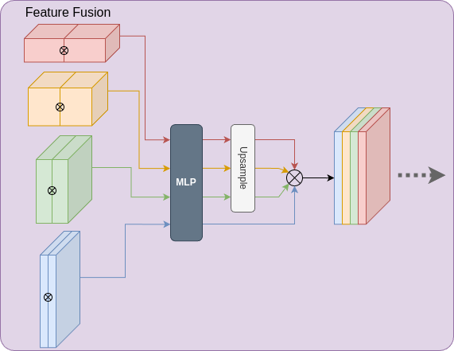

# HDRSeg-UDA: Unsupervised Domain Adaptation for Semantic Segmentation of High Dynamic Range Images under Adverse Conditions

The training framework leverages unsupervised domain adaptation to enable robust semantic segmentation across diverse weather conditions. Unlike standard images, High Dynamic Range (HDR) images contain significantly higher bit depth, allowing for richer visual information. By extracting the enhanced feature representations in HDR images, the model achieves improved segmentation performance, especially under extreme weather scenarios.

.png)

## Introduction

This model employs two parallel SegFormer encoders to extract complementary features from a single HDR image, aiming to fully exploit the rich information inherent in HDR imagery. The resulting dual sets of feature maps are subsequently fused via a Feature Fusion Module and then passed to the SegFormer decoder for semantic segmentation.

